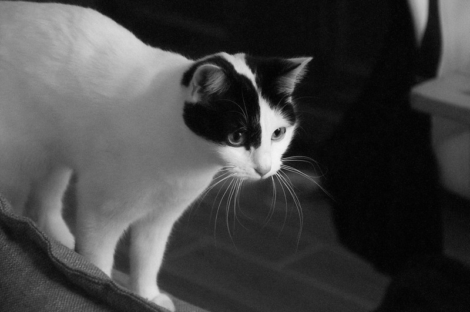
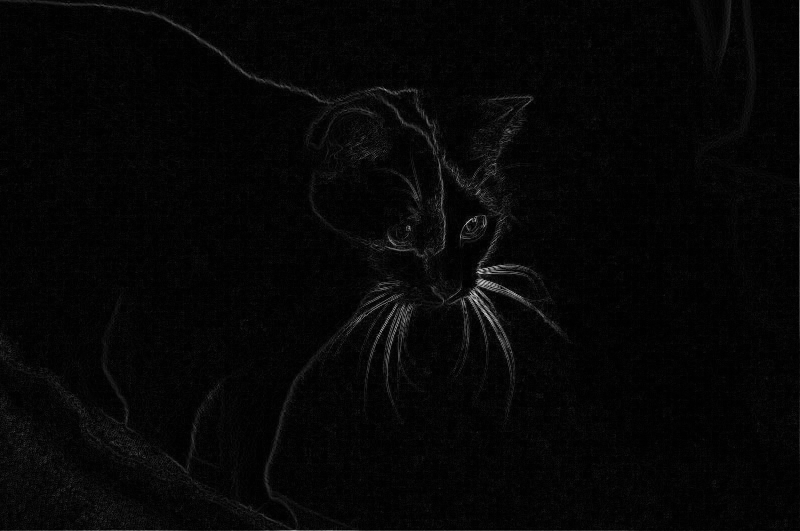

# Image Processing

This project is a simple image processing library I wrote so that I could more easily run operations on images withing one of my classes.
I was unhappy with how the professors provided code worked, so I wrote my own library from scratch which uses image and pixel strcutures, among other things. Guided by the PNM documentation I found [here](https://netpbm.sourceforge.net/doc/pnm.html), I wrote this library that (for now) reads PPM and PGM images and gives multiple X,Y coordinate based operations.

Along with the library that is present in `/src/lib`, there is also a series of executables in `src/exec` that which implement what I have written in the library. This includes various color space conversions, bluring, thresholds and contour calculation.

Example
```./norme_gradient_pgm mycat.pgm mycat_grad.pgm```
| `mycat.pgm` | `mycat_out.pgm` |
|-------------|-----------------|
|||

(note: this are being displayed from PNGs because github's markdown won't display PNM images. I need to make a PNM to PNG converter I think.)

# Requirements

`CMake 2.24.1` is currently the only requirement (subject to change as development continues) to bulid the project, as the code base is written entirely in native C code. So nothing is imported.
